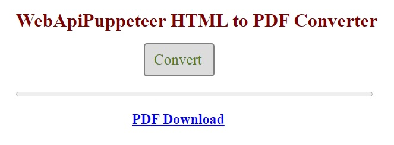

# WebApiPuppeteer-test

Web service written in C# using ASP.NET Core 6 WebApi.

Сonverts HTML files to PDF files using [Puppeteer Sharp](https://www.puppeteersharp.com/index.html).

Solution includes a JavaScript client in the wwwroot folder (starts automatically).

#

#

How does it work:

1.  Client sends file using an HTTP POST request to http://localhost:5114/converter (FormData object).
2.  Server saves file by adding a unique id (Guid structure) to its name and sends this id to the client.
3.  Puppeteer Sharp converts HTML file to PDF file.
4.  To get file, client sends an HTTP GET request to http://localhost:5114/converter/{id} (eg http://localhost:5114/converter/622c42ce-6cb4-4baf-b25f-4dbea7ca038d).
5.  The server sends file to the client, removing the unique id from its name.
6.  The server deletes sent file.

This implementation allows client to retrieve file even if server has rebooted after receiving file.
Converted PDF file will remain on server until it is downloaded.

Notes:

The first conversion request can take 15-20 seconds because Puppeteer Sharp is downloading a local version of the Chromium browser.

Microsoft Visual Studio 2022 was used.
